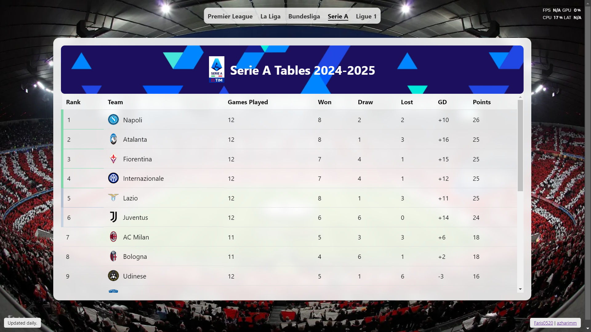

# Football Leagues Tables Using Python Flask

https://futbol.farisdaffa.id

 This website displays several standings from football leagues around the world, such as La Liga, Premier League, Bundesliga, etc.

___
- This is a continuation of the epl-standings-flask project. I hope u like it :)

Credit to [azharimm](https://github.com/azharimm/football-standings-api) for the API's (ESPN API)

